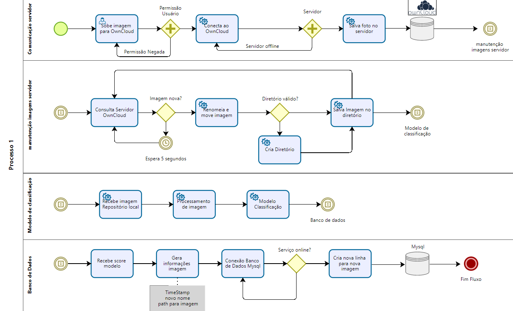

Repositório destinado ao desenvolvimento do projeto final de sistemas operacionais embarcados 



O Fluxo acima demonstra utilizando a notação BPMN o fluxo referente a nossa solução, mostrando cada etapa e subprocessos necessários para o fluxo completo.

# **Dependências de sistema operacional, OpenCV**

## Install package python3-opencv with following command in terminal (as root user).

```bash
sudo apt-get install python3-opencv
```

Then in your environment run:
```bash
pip install opencv-python
```
Open Python IDLE (or IPython) and type following codes in Python terminal.
```python
import cv2 as cv
print(cv.__version__)
```
If the results are printed out without any errors, congratulations !!! You have installed OpenCV-Python successfully.

## **Building OpenCV from source**

Compiling from source may seem a little complicated at first, but once you succeeded in it, there is nothing complicated.

First we will install some dependencies. Some are required, some are optional. You can skip optional dependencies if you don't want.
Required build dependencies

We need CMake to configure the installation, GCC for compilation, Python-devel and Numpy for building Python bindings etc.
```bash
sudo apt-get install cmake
sudo apt-get install gcc g++
```
* to support python3:
```bash
sudo apt-get install python3-dev python3-numpy
```

Next we need GTK support for GUI features, Camera support (v4l), Media Support (ffmpeg, gstreamer) etc.
sudo apt-get install libavcodec-dev libavformat-dev libswscale-dev
sudo apt-get install libgstreamer-plugins-base1.0-dev libgstreamer1.0-dev

* to support gtk2:
```bash
sudo apt-get install libgtk2.0-dev
```

* to support gtk3:
```bash
sudo apt-get install libgtk-3-dev
```
## **Optional Dependencies**

Above dependencies are sufficient to install OpenCV in your Ubuntu machine. But depending upon your requirements, you may need some extra dependencies. A list of such optional dependencies are given below. You can either leave it or install it, your call :)

OpenCV comes with supporting files for image formats like PNG, JPEG, JPEG2000, TIFF, WebP etc. But it may be a little old. If you want to get latest libraries, you can install development files for system libraries of these formats.

```bash
sudo apt-get install libpng-dev
sudo apt-get install libjpeg-dev
sudo apt-get install libopenexr-dev
sudo apt-get install libtiff-dev
sudo apt-get install libwebp-dev
```

Para mais dúvidas, acessar:
[Installing OpenCV-Python from Pre-built Binaries](https://docs.opencv.org/master/d2/de6/tutorial_py_setup_in_ubuntu.html)